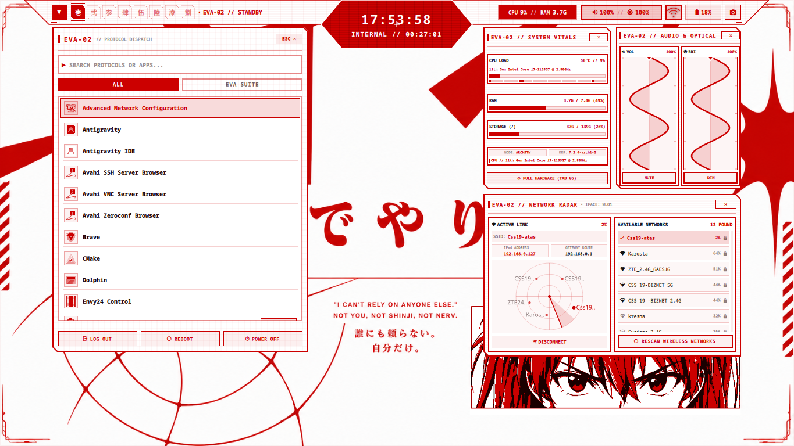
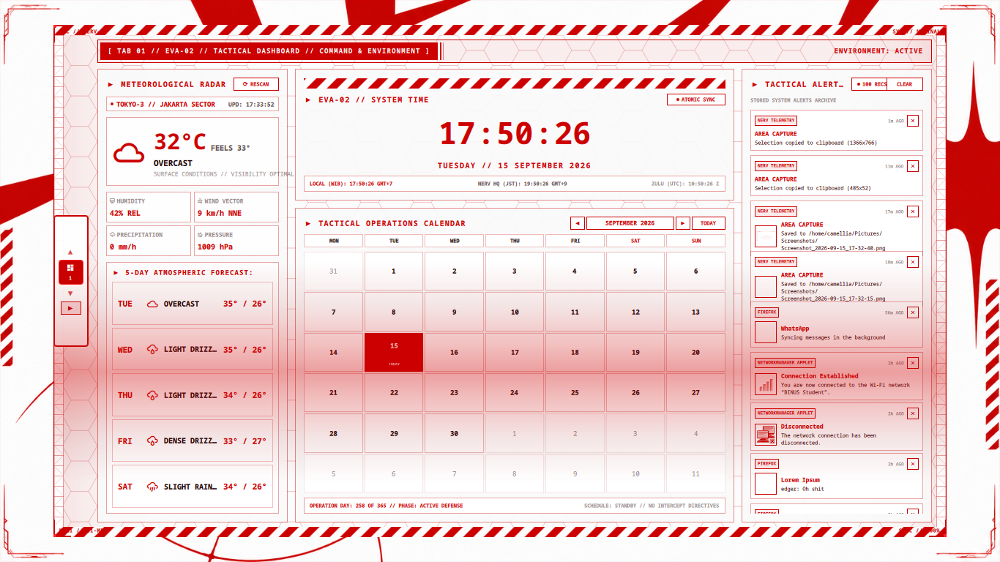
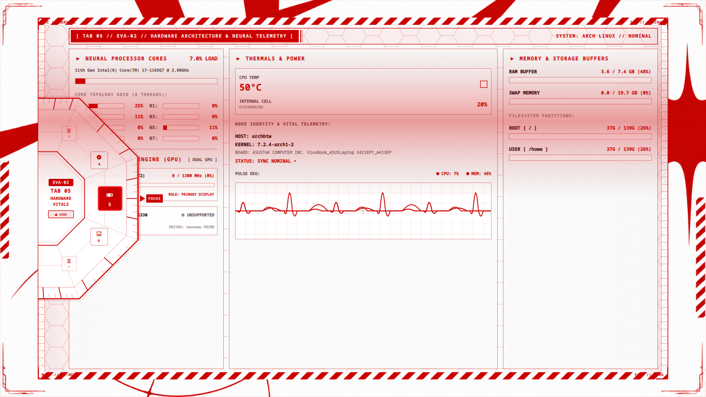

# Asuka Shell(shell themed based on asuka from evangelion!)

A high-performance, super detailed desktop shell for Linux and Hyprland, built with Quickshell (Qt6/QML) and C++. Designed after the high-tech NERV tactical-white terminal aesthetic from Neon Genesis Evangelion, packed with EVA-02 crimson accents and MAGI diagnostic vibes.

---

## Overview & Design Philosophy

Asuka Shell is a shell based on Asuka Langley Soryu from Neon Genesis Evangelion. It moves from the standard UI philosophy(modularity "do one thing well") to a more centralized experience where the controlcenter is the main highlight.

---

## Showcase

### Top Bar & Workspaces
The top bar auto-hides when you don't need it, features Kanji Daiji workspace numbers (壱, 弐, 参...), a centered clock, and clickable popout cards for quick volume, brightness, hardware vitals, and launcher shortcuts.



### The Control Center Dashboard
Press `SUPER + SPACE` to bring up the main dashboard. Shows live weather forecasting, a digital chronometer, pilot profile, operations calendar, and notification history.



### Rotary Wheel & System Vitals
The 8-tab rotary wheel lets you cycle between tabs with smooth wheel animations. The hardware vitals tab gives you per-core CPU loads, RAM usage, temps, and live pulse graphs.



---

## Companion EVA Tools (Optional)

The shell also hooks up to custom companion CLI and GUI tools if you have them installed (Tab 07 lets you control them directly):

- **evacore**: Background daemon manager that keeps everything running smoothly.
- **evaterm**: Alacritty/Foot-based terminal themed with NERV red-on-white colors.
- **evafile**: Custom Qt6 file manager with EVA Unit-02 styling.
- **evalink**: Built-in aria2c download manager with quick URL paste and status tracking.
- **evatube**: Quick yt-dlp downloader wrapper.
- **evasort**: Auto-sorts messy ~/Downloads into organized folders by file type.
- **evamagi**: CLI MAGI diagnostic monitor for system stats.

---

## What You Need

### The Basics
- Linux with Wayland
- **Hyprland** (what this is built and tested on)
- **Quickshell** (latest git or release with Qt6 support)
- Qt 6 (QML, Quick, Controls2, Multimedia)
- **PipeWire** & WirePlumber (`wpctl` for volume controls)
- `grim` & `slurp` (for the area screenshot tool)
- `wl-clipboard` (for clipboard copy/paste)

### Fonts
You really need these two fonts or the UI won't look right:
- **Liberation Sans** (main UI text)
- **JetBrainsMono Nerd Font** (icons and monospaced stats)

On Arch Linux:
```bash
sudo pacman -S ttf-liberation ttf-jetbrains-mono-nerd
```

### Build Tools & Python
- `g++` & `make` (to compile the fast C++ helpers for app search & vitals)
- `python3` with `requests` (for weather info on the dashboard)

---

## How to Install

### 1. Clone into quickshell config
Clone this repo directly into `~/.config/quickshell/evangelion`:

```bash
git clone https://github.com/projectevangelion/asuka-shell.git ~/.config/quickshell/evangelion
cd ~/.config/quickshell/evangelion
```

### 2. Build the C++ helpers
We use tiny compiled C++ binaries to make app scanning and hardware vitals super fast:

```bash
make
```

To check that everything built and linted properly:

```bash
make check
```

### 3. Start it up!
Test running it from the terminal:

```bash
quickshell -p ~/.config/quickshell/evangelion
```

To make it start automatically when you log into Hyprland, drop this into your `~/.config/hypr/hyprland.conf`:

```ini
exec-once = quickshell -p ~/.config/quickshell/evangelion
```

---

## SDDM Login Themes

There are two custom SDDM themes included inside `sddm/`:

### 1. Evangelion Intro Theme (Recommended)
Has the cool oscilloscope sine wave video loop and floating login prompt:

```bash
sudo make install-sddm-intro
```

You can test how it looks in a window without logging out:
```bash
make test-sddm-intro
```

### 2. Evangelion Asuka Theme
Unit-02 themed standby screen with shader effects:

```bash
sudo make install-sddm-asuka
```

Test it in a window:
```bash
make test-sddm-asuka
```

---

## Useful Keybinds for Hyprland

Add these to your `~/.config/hypr/hyprland.conf` so everything hooks together nicely:

```ini
# Open / Close the Control Center
bind = SUPER, SPACE, exec, quickshell -p ~/.config/quickshell/evangelion ipc call controlcenter toggle

# Area screenshot HUD (copies to clipboard + saves to ~/Pictures/Screenshots)
bind = SUPER SHIFT, S, exec, quickshell -p ~/.config/quickshell/evangelion ipc call areapicker start

# Volume buttons (PipeWire / wpctl)
bindel = , XF86AudioRaiseVolume, exec, wpctl set-volume @DEFAULT_AUDIO_SINK@ 5%+
bindel = , XF86AudioLowerVolume, exec, wpctl set-volume @DEFAULT_AUDIO_SINK@ 5%-
bindl  = , XF86AudioMute, exec, wpctl set-mute @DEFAULT_AUDIO_SINK@ toggle

# Screen Brightness buttons
bindel = , XF86MonBrightnessUp, exec, ~/.config/quickshell/evangelion/scripts/set_brightness.sh +5
bindel = , XF86MonBrightnessDown, exec, ~/.config/quickshell/evangelion/scripts/set_brightness.sh -5
```

---

## Folder Structure

Here's a quick look at how the files are organized:

```
.
|-- shell.qml                          # Main entrypoint & IPC router
|-- assets/                            # Sounds, wallpapers, icons, and logos
|-- components/                        # Reusable HUD elements (buttons, cards, rotary wheel)
|-- modules/
|   |-- bar/                           # Top bar + popout drawers
|   |-- controlcenter/                 # The big 8-tab control center overlay
|   |-- areapicker/                    # Screenshot tool HUD
|   |-- background/                    # Wallpaper switcher
|   +-- popups/                        # Toast notifications
|-- scripts/                           # Fast C++ helpers and python bridges
+-- sddm/                              # Login screen themes (intro & asuka)
```

---

## Testing & Linting

If you're making tweaks to the QML files, run this to make sure `qmllint` is happy and nothing is broken:

```bash
make lint
```

---

## License & Credits

MIT License. Neon Genesis Evangelion, NERV, and Asuka Langley Soryu are property of Studio Khara / Gainax.
